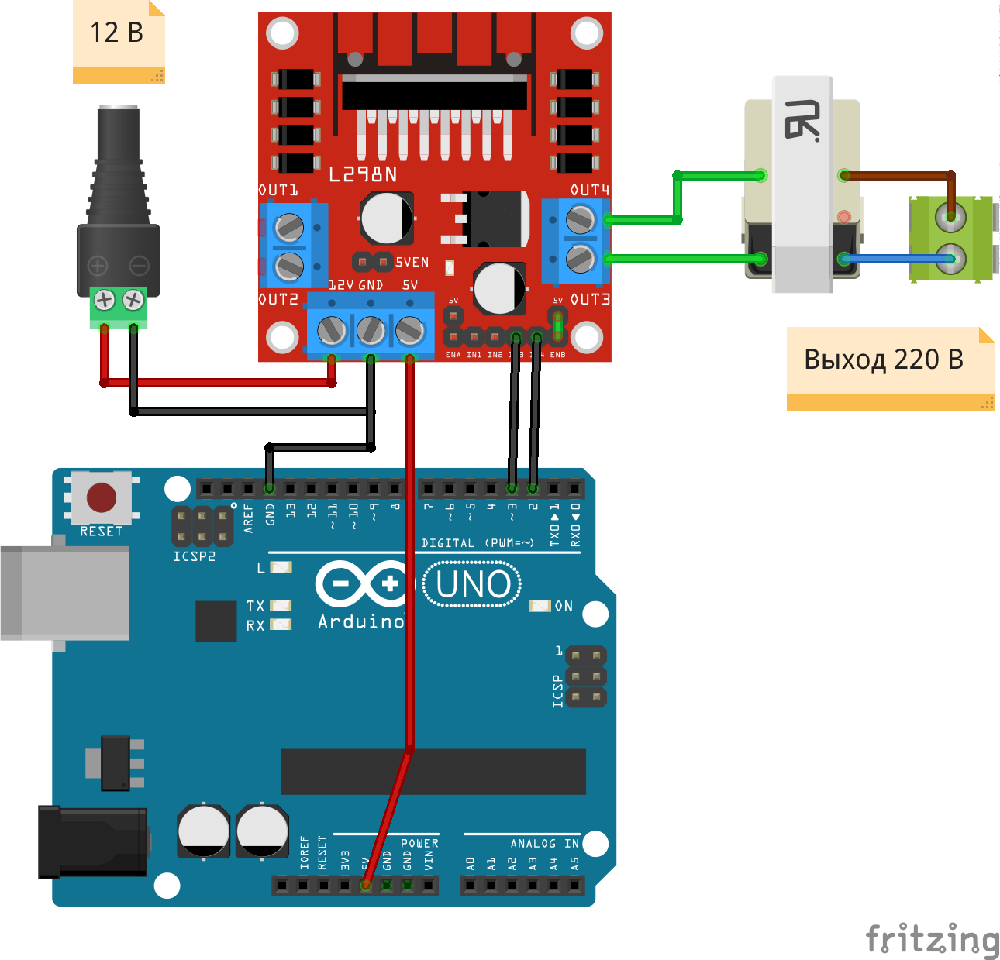
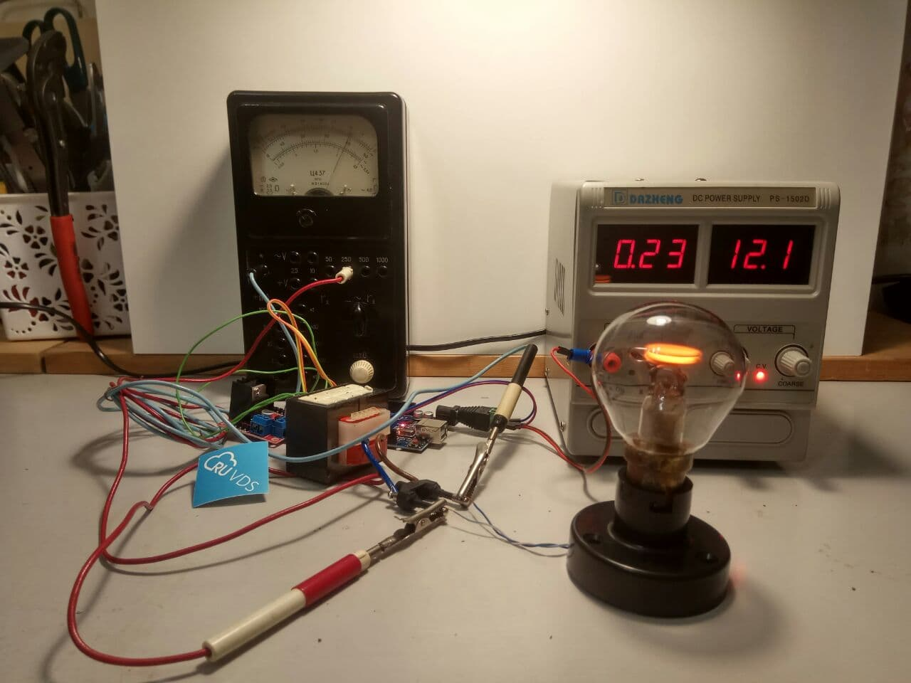

# DC-AC блок питания на 220 В

Блок питания выполнен на ардуино, из трансформатора на 12 В. Для работы нужно:

* Arduino
* Драйвер двигателя L298N
* Блок питания, в идеале регулируемый, но подойдёт и на 12 В
* Трансформаторный блок питания на 12 В

Пример работы

